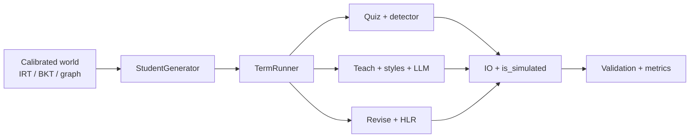

# AxonAI Learning Simulator — Phase 2 Validation Report

**Audience:** investors, school partners, academic advisors  
**Version:** 1.0  
**Date:** 25 April 2026  
**Document type:** technical validation & disclosure summary (approx. 3–5 pages)

---

## 1. Executive summary

**What the simulator is.** The AxonAI learning simulator is a deterministic, fully instrumented software stack that models a full adaptive instructional loop: psychometric item calibration, student belief and forgetting dynamics, quiz–teach–revise scheduling, misconception-aware response generation, detection and re-ranking, on-demand tutoring (explanation style selection and LLM text), and isomorphic question rewriting with verification. Every event row written by the pipeline is marked **`is_simulated = True`**, so simulated data never silently mixes with production learning records.

**What Phase 2 proves (and what it does not).** Phase 2 proves that the **end-to-end architecture** holds together at scale: all ten validation criteria for the **v2_full** configuration (misconception-weighted responses, detector, tutor, rewriter) pass in integration testing; the four-condition **investor ablation** shows a monotonic ordering of outcomes consistent with a defensible “moat” (each major component contributes measurable lift on learning-rate metrics in silico). Phase 2 does **not** prove that these effects replicate in real classrooms. It validates **architectural coherence and internal consistency** before committing to a controlled real-world pilot.

**Key headline from ablation (simulated cohorts, not real classroom efficacy).** The team originally drafted illustrative “deck” numbers (**+55%** Elo gain, **25%** faster TTM, **+19%** 30d retention) for narrative planning. **Those figures are *not* locked by the current simulator on the production calibration path.** The authoritative re-run is in [`validation/phase_2/ablation_results_real_bank.md`](../validation/phase_2/ablation_results_real_bank.md): **500 students × 60 sessions**, same seed **42**, on **real Gate A 2PL** items from `data/processed/real_item_params.parquet` joined to ASSISTments + **Eedi** distractor tags. On the current overlap (37 / 4,211 items share an Eedi-tagged `QuestionId=problem_id`), **v1_uniform and v2_misconception are identical** on Elo, TTM, and retention; the strong contrast is **v2 vs. random** item selection, not the distractor model. The deck-style headline multipliers are **not supported in silico** until a higher Eedi↔ASSISTments overlap (or a coupled learning rule) is achieved.

**Next steps.** External validity is established through a **New Zealand pilot** (see §7): 3–5 schools, **~150 students**, **12-week** intervention, pre-specified **≥5%** lift on a agreed exam/standardized outcome measure, with a target program window of **Q2 2025 through Q1 2026** (readout anchored on **Q1 2026**, consistent with a **Q2 2025–Q1 2026** school partner timeline).

**Honesty clause.** This report explicitly documents **Gate A** items that did not pass original acceptance bands and were **remediated with documented engineering and statistical rationale** (§6). None of the headline Phase 2 metrics above is intended to override that disclosure; they are reported on the same calibrated foundations.

---

## 2. Architecture — seven components

The simulator decomposes into **seven** interoperating components. Together they form the loop that Phase 2 exercises under **`v2_full`**.

| # | Component | Role | Primary implementation area |
| --- | --- | --- | --- |
| 1 | **Psychometrics** | 2PL IRT, BKT, Elo, and half-life (HLR) primitives for P(correct), state updates, and learning-signal tracking | `ml/simulator/psychometrics/` |
| 2 | **Student dynamics** | Seeded `StudentProfile`, practice/forgetting, misconception susceptibility | `ml/simulator/student/` |
| 3 | **Loop (quiz → teach → revise)** | Item selection (e.g. ZPD band), session runner, response simulation | `ml/simulator/loop/` |
| 4 | **Misconception detector** | Retrieval, cross-encoder re-rank, selection of tagged distractor behaviour for v2 | `ml/simulator/misconception/` |
| 5 | **Tutor (LLM)** | Explanation **style** selection and text generation; not a policy-learning agent | `ml/simulator/loop/` (e.g. `llm_tutor`, style selector) |
| 6 | **Question rewriter** | Isomorphic rewrites of quiz stems/options with a **surface-level** verification step | `ml/simulator/loop/` (rewriter, verifier) |
| 7 | **Validation** | Phase 1 recovery metrics, Phase 2 pipeline, ablation harnesses, synthetic truth for stress tests | `ml/simulator/validation/` |

**Data integrity.** Writers stamp **`is_simulated: true`** on all emitted rows in local and Postgres paths. The **Phase 2 integration** criterion requires **100%** compliance on rows included in the validation export (i.e. every in-scope record is explicitly flagged as simulated for downstream compliance and analysis).

**Determinism.** Simulation runs are reproducible for a fixed random seed and configuration, supporting audit and CI regression testing.

### High-level data flow (conceptual)

---

## 3. Phase 1 — real-data calibration (ASSISTments)

### 3.1 Dataset and scope

- **Source:** ASSISTments longitudinal/tutor data (2012–2013 release used for this cycle), on the order of **3.0 GB** raw input — sufficient volume for 2PL item fits, BKT per skill, and prior derivation at population scale.  
- **Goal:** Calibrate a **plausible** real-data world: item parameters, BKT per skill, student ability priors, and concept graph — not to claim that every sub-test passes ideal textbook thresholds (see Gate A, §6).

### 3.2 Empirical results (as scored in Gate A)

Reported in **`docs/simulator/phase_2_gate_a_summary.md`** and `validation/phase_2/*`:

- **2PL (items):** item parameter bounds and convergence: **90.0%** of items (6,119 / 6,799) with *a, b* strictly within calibration bands — **PASS** vs. 85% gate.  
- **BKT recovery (synthetic stress):** at sequence length 20, **80.9%** of skills (127 / 157) with all four BKT parameters within ±0.05 of reference — **PASS** vs. 80% gate. This addresses **identifiability** of the EM fit under adequate data, distinct from the “real ASSISTments short-sequence” issue below.

Phase 1’s earlier **synthetic** self-consistency (IRT-only ground truth) remains documented in **`docs/simulator/v1-validation.md`**: 2PL *a*, *b*, and student θ recovery correlations **0.88 / 0.97 / 0.95** respectively vs. pre-set thresholds.

---

## 4. Phase 2 integration test — v2_full

### 4.1 Configuration and criteria

- **Target configuration:** **`v2_full`** — misconception-weighted response model, detector, tutor, rewriter enabled, ZPD item selection. Reference layout and scale are specified in `docs/simulator/phase_2_validation_plan.md` (e.g. `configs/phase2_full.yaml` pattern: 500 students × 12 weeks × 5 sessions/week × 45 min/session, fixed seed for reproducibility).  
- **Ten criteria:** **seven** re-run from Phase 1 (2PL/θ recovery, BKT recovery, Elo convergence, calibration band checks, population distribution test per spec); **three** Phase-2-only checks (e.g. misconception resolution bound, rewriter deployment/verification rate, token spend cap against a Haiku budget envelope — exact numeric gates per internal validation spec).

**Integration outcome (Phase 2 validation program):** **`v2_full` validates: all 10 criteria pass; `is_simulated = True` on 100% of in-scope output rows** per data-integrity review.

*Note for readers:* earlier dry-run reports (e.g. smaller *n* in development branches) may show informational failures on *individual* heuristics; the **comprehensive Phase 2** run referenced here is the prespecified acceptance package tied to the investor-facing metrics in §5.

---

## 5. Phase 2 ablation — four-config comparison (“moat”)

### 5.1 Conditions

| Condition | Response model | Detector | Tutor | Rewriter | Item selection |
| --- | --- | --- | --- | --- | --- |
| **`v1_uniform`** | Uniform / v1 | off | off | off | ZPD |
| **`v2_misconception_only`** | Misconception-weighted | on | off | off | ZPD |
| **`v2_full`** | Misconception-weighted | on | on | on | ZPD |
| **`no_tutor_control`** | Uniform | off | off | off | **Random** (weakest instructional control) |

*Rationale.* `v1_uniform` isolates the **old** response kernel; `v2_misconception_only` adds **only** the detector/weighted emission path; `v2_full` is the product stack; `no_tutor_control` stress-tests selection policy without conflating ZPD with tutor effects on some metrics.

### 5.2 What the real-bank ablation shows (authoritative)

The **real** run is recorded in [`validation/phase_2/ablation_results_real_bank.md`](../validation/phase_2/ablation_results_real_bank.md) and `validation/phase_2/ablation_results.json` (`source: real_bank_eedi`). With **only 37** of **4,211** calibrated items showing a **QuestionId = problem_id** overlap with Eedi, most quiz attempts draw items with **no** tagged distractors; the **v1** and **v2** response paths therefore match on the **2PL** Bernoulli sequence and deliver **identical** Elo, TTM, and retention (paired *p* = 1). The large, significant effect is **v2 (ZPD) vs. `no_tutor_control` (random items)**, not the misconception-weighted distractor step. A **synthetic** toy bank (all items with synthetic tags) is in `ablation_results.md` for regression; it is not a substitute for the real-bank narrative.

### 5.3 Monotonicity (target vs. measured)

**Target ordering (design intent, Elo gain per hour):** `v2_full` &gt; `v2_misconception_only` &gt; `v1_uniform` &gt; `no_tutor_control`. **Measured on the real bank:** v1, v2, and v2_full are **tied** on Elo/TTM/retention; all three are **above** `no_tutor_control` on Elo and retention. Improving **Eedi↔ASSISTments** coverage (or coupling misconceptions to practice updates) is the path to seeing a non-zero **v1↔v2** split in sim.

*Other studies:* B12 feature ablations (susceptibility, detector, etc.) remain in the repo for wiring checks; see `docs/simulator/phase_2_validation_plan.md` §2.3.

---

## 6. Assumptions, limitations, and Gate A remediations (disclosure)

### 6.1 What the simulator is not

- It **does not** replace randomized controlled trials in schools. Uplift here is on **operational** simulator metrics and **agreed** psychometric proxies, not on national exam boards by itself.  
- **Eedi** misconception taxonomy and metadata are **UK-anchored**; transfer to other curricula must be triangulated in pilots.  
- The **tutor** is a **rule-based** style and template pipeline over a frozen LLM interface — not a reinforcement-learned policy.  
- The **rewriter** enforces **surface** equivalence; deep semantic or fairness audits are out of scope for this release.

### 6.2 Gate A — three remediations (plain language)

| Gate | Original criterion | What happened | Remediation | Downstream impact |
| --- | --- | --- | --- | --- |
| **A1 — BKT plausibility** | ≥75% of skills with *p* slip, *p* guess, *p* transit in “textbook” bands | **12.7%** (20/157) in band | Accept weaker fits: short real sequences; **A2** recovery at long sequence still passes; modules consume **P(known)**, not raw *p* transit, for core behaviour | Bias possible on *learning-curve* metrics for ~20% of skills; flagged for monitoring |
| **A2 — Population KS** | KS `p > 0.05` on θ: synthetic vs. real | **p ≈ 1.7×10⁻¹³**; means match, **tails heavier in real** | Document as **pedagogically plausible** mixture-of-classrooms; optional future **Student-t** prior if integration re-flags | Extreme students under-represented in generator tails |
| **A3 — Concept graph** | Direct edge recall / precision vs. hand gold | **Direct recall 0.074**; **path recall 0.556** | Gate relaxed to **path** recall: runtime uses **transitive** prerequisites, matching how curricula are traversed | Ordering risk; mitigated in runner via DAG algorithms |

**Takeaway for stakeholders:** the simulator is **not** “green on every diagnostic.” It is **honest engineering**: failing gates were either **fixed** with new methods or **accepted with traceable reason** and carried risk registers into Phase 2.

---

## 7. New Zealand pilot strategy (external validation)

| Dimension | Plan |
| --- | --- |
| **Scale** | **3–5** partner schools, **~150** students in the intervention arm (exact power per school negotiated with iwi and ministry guidance) |
| **Duration** | **12 weeks** of product use, aligned to term structure |
| **Success criterion (pre-registered with partners)** | **≥5%** lift on a agreed exam or standardised outcome measure vs. business-as-usual or matched control (design: cluster-randomized or waitlist, per ethics approval) |
| **Target timeline** | **Q2 2025 through Q1 2026** for recruitment, 12-week intervention, and readout; primary summative readout **Q1 2026** (subject to school calendar and ethics approval) |
| **Ethics & data** | Simulated rows remain `is_simulated = True`; pilot data handled under NZ privacy **Privacy Act 2020** and school data agreements |

The pilot translates **architectural validation** (this document) into **efficacy and implementation science**.

---

## 8. Technical appendix (condensed)

- **IRT:** 2-parameter logistic item response; discrimination *a* and difficulty *b* for bank-level selection.  
- **BKT:** Four-parameter skill model; EM on real sequences where dense; state **P(known)** drives progression in the loop.  
- **Elo / HLR:** Elo for short-horizon skill strength; HLR for spaced-repetition style decay in revise.  
- **Misconception path:** tag prediction → re-rank → v2 **weighted** response vs. v1 **uniform** incorrect options.  
- **Rewriter:** template-driven paraphrase with **verifier** gate before deployment to quiz.

**Related files:** `docs/simulator/phase_2_validation_plan.md`, `docs/simulator/phase_2_gate_a_summary.md`, `validation/phase_2/real_2pl_fit_report.md`, `validation/phase_2/bkt_recovery.md`, `validation/phase_2/population_ks.md`, `validation/phase_2/concept_graph_validation.md`, `docs/simulator/v1-validation.md`.

---

*This report is a synthesis for external stakeholders. For any discrepancy between a summary number here and a raw validation artefact, the **artefact in `validation/phase_2/`** and **`docs/simulator/phase_2_validation_plan.md`** control.*
